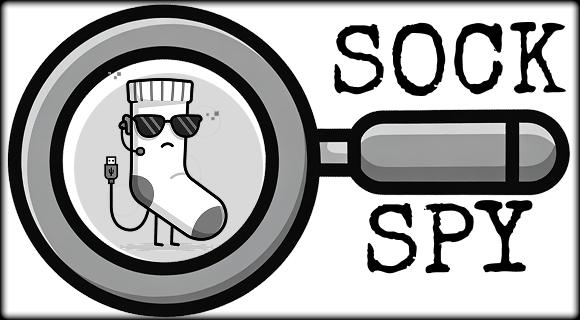

<p align="center">
  
</p>

# 🧦 Sock Spy

**Sock Spy** is an open-source tool designed for educational and awareness purposes. It assists users in understanding how easily fictitious online identities ("sock puppets") can be created, emphasizing the importance of vigilance in digital interactions.

---

## 🧠 Purpose

Sock Spy aims to:

- Demonstrate the simplicity of creating fake online profiles.
- Educate users on potential risks associated with accepting unknown contacts on social media.
- Provide a resource for cybersecurity training and awareness programs.

---

## ✨ Features

- 🔐 Generates fictional identity data.
- 📁 Organized project structure for ease of use.
- 🧪 Suitable for educational labs, awareness campaigns, and training exercises.

---

## 🧭 Ethical Use Commitment

Sock Spy is intended **strictly for educational and awareness purposes**. Users are encouraged to:

- Utilize the tool responsibly and within legal boundaries.
- Respect the privacy and rights of others.
- Avoid any activities that could cause harm or distress.

**Disclaimer:** Sock Spy is provided "AS IS" for educational and awareness purposes only. The developers assume no responsibility for misuse of the software. Users are solely accountable for ensuring compliance with all applicable laws and regulations.

---

## 🧭 Ethical Use Policy

Sock Spy is intended strictly for educational and awareness purposes. Users must adhere to the guidelines outlined in our [Ethical Use Policy](ethical_use_policy.txt) also at your disposal there are the [Terms of use](terms_of_use.txt).

By using this tool, you agree to comply with these terms. If you do not agree, you are prohibited from using Sock Spy.

---

## 🚀 Getting Started

### 🔧 Requirements

- Python 3.x

### 📥 Installation

```bash
git clone https://github.com/Kanarath/Sock_Spy.git
cd Sock_Spy
pip install -r requirements.txt


```

---

### 📄 License
Sock Spy is licensed under the GNU General Public License v3.0. You may use, modify, and distribute this software in accordance with the terms of the GNU GPL v3.0. For more details, please refer to the [LICENSE](license.md) file included with this project.

### 🤝 Contributing
Contributions to Sock Spy for furthering its educational purpose are welcome. If you wish to contribute, please adhere to the guidelines outlined in our [Contributing](contributing.md) and ensure that your additions align with the ethical use of this tool.

### 📬 Contact
For questions, suggestions, or more information about Sock Spy:

GitHub: [Kanarath](https://github.com/Kanarath)